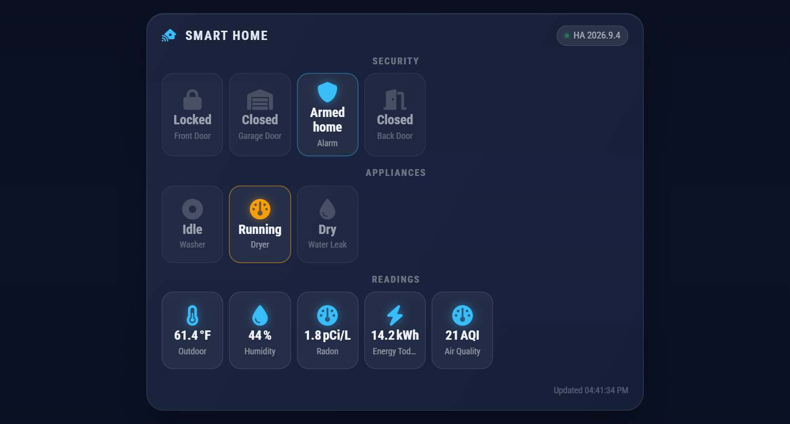

# MMM-HomeAssistantStatusDashboard

A MagicMirror² module that shows a real-time status dashboard for Home Assistant entities, with visual alerting for any conditions that require attention.

Uses the **Home Assistant WebSocket API** for near-instant state updates — no polling delay.

---

## Preview

<p align="center">
  
</p>

*Night theme with sample entities: status tiles grouped by `group` (an active alarm in blue, a dryer
running in amber, inactive tiles dimmed), and data-reporting entities collected in the blue
Readings group.*

**Visual state key (colour-coded in the live display):**

| Appearance | Meaning |
|---|---|
| Red border + pulsing glow + `●` corner dot | Alert condition met (`alertWhen` / `alertAbove` / `alertBelow`) |
| Blue icon glow | Active state — `on`, `locked`, `home`, `detected`, … |
| Blue icon (same blue), in the "Readings" group | Data reading — temperature, humidity, radon level, … (see `kind`) |
| Amber icon | Transitional state — `opening`, `closing`, `arming`, … |
| Dimmed tile | Inactive state — `off`, `closed`, `idle`, … |
| Faded tile | Entity unavailable or unknown in HA |

The **alert banner** (top strip) appears whenever any entity is alerting and lists all offenders as chips. The **connection dot** (`●`) next to the HA version pulses green when live and turns red on disconnect.

---

## Features

- Persistent WebSocket connection to HA for real-time state changes
- Configurable entity tiles organised into labelled groups
- Auto-detected domain icons (binary_sensor, sensor, light, switch, climate, lock, cover, …)
- Three alert trigger types: `alertWhen` (state equals), `alertAbove`, `alertBelow`
- Flashing alert banner listing all currently-alerting entities
- Optional push to MagicMirror's built-in **Alert** module on new alerts
- Pulsing red tile highlight + blinking dot for alerting entities
- Connection status indicator with HA version
- Automatic reconnection on disconnect
- Glass aesthetic matching MMM-GlassCalendar (dark / light themes)

---

## Installation

```bash
cd ~/MagicMirror/modules
# Copy or symlink this folder here, then:
cd MMM-HomeAssistantStatusDashboard
npm install --omit=dev
```

### Font Awesome

Icons use the Font Awesome build that ships with MagicMirror² (`font-awesome.css`, currently FA 7 free), so no extra install is needed. Use free `fa-solid` / `fa-regular` icon names.

---

## Update

```bash
cd ~/MagicMirror/modules/MMM-HomeAssistantStatusDashboard
git pull
npm install --omit=dev
```

Then restart MagicMirror (for example `pm2 restart MagicMirror`).

## Home Assistant: Long-Lived Access Token

1. In HA, go to **Profile → Security → Long-Lived Access Tokens**
2. Create a token and copy it
3. Paste it as the `token` value in `config.js`

> **Keep your token secret.** Do not commit `config.js` to a public repo.

---

## MagicMirror `config.js` example

```js
{
  module: "MMM-HomeAssistantStatusDashboard",
  position: "bottom_left",
  config: {
    header: "Smart Home",
    haUrl: "http://homeassistant.local:8123",
    token: "YOUR_LONG_LIVED_TOKEN",

    groupOrder: ["Security", "Climate", "Lights", "Power"],
    tilesPerRow: 3,

    entities: [
      // ── Security ──────────────────────────────────────────
      {
        entity_id: "binary_sensor.front_door",
        name: "Front Door",
        group: "Security",
        alertWhen: "on",
        alertLabel: "OPEN"
      },
      {
        entity_id: "binary_sensor.back_door",
        name: "Back Door",
        group: "Security",
        alertWhen: "on",
        alertLabel: "OPEN"
      },
      {
        entity_id: "binary_sensor.smoke_detector_kitchen",
        name: "Smoke (Kitchen)",
        group: "Security",
        alertWhen: "on",
        alertLabel: "SMOKE!"
      },
      {
        entity_id: "lock.front_door_lock",
        name: "Front Lock",
        group: "Security",
        alertWhen: "unlocked",
        alertLabel: "UNLOCKED"
      },

      // ── Climate ────────────────────────────────────────────
      {
        entity_id: "sensor.living_room_temperature",
        name: "Living Room",
        group: "Climate",
        alertAbove: 28,
        alertBelow: 14
      },
      {
        entity_id: "sensor.bedroom_temperature",
        name: "Bedroom",
        group: "Climate",
        alertAbove: 26,
        alertBelow: 14
      },
      {
        entity_id: "sensor.living_room_humidity",
        name: "Humidity",
        group: "Climate",
        alertAbove: 70,
        alertBelow: 30
      },
      {
        entity_id: "climate.living_room",
        name: "Thermostat",
        group: "Climate"
      },

      // ── Lights ────────────────────────────────────────────
      {
        entity_id: "light.govee_permanent_outdoor",
        name: "Outdoor Lights",
        group: "Lights",
        attribute: "effect"   // shows current Govee scene name
      },
      {
        entity_id: "light.front_door",
        name: "Front Door",
        group: "Lights",
        attribute: "effect"
      },
      {
        entity_id: "light.lamp_post",
        name: "Lamp Post",
        group: "Lights",
        attribute: "effect"
      },
      {
        entity_id: "light.living_room",
        name: "Living Room",
        group: "Lights"
      },
      {
        entity_id: "light.kitchen",
        name: "Kitchen",
        group: "Lights"
      },

      // ── Power ─────────────────────────────────────────────
      {
        entity_id: "sensor.daily_energy",
        name: "Today kWh",
        group: "Power",
        alertAbove: 20
      }
    ]
  }
},
```

---

## Configuration reference

| Option | Type | Default | Description |
|---|---|---|---|
| `header` | string | `"Home Assistant"` | Module header text |
| `haUrl` | string | `"http://homeassistant.local:8123"` | Base URL of your HA instance |
| `token` | string | `""` | Long-lived access token |
| `entities` | array | `[]` | Entity configs — see below |
| `groupOrder` | array | `[]` | Ordered list of group names; unlisted groups appended alphabetically |
| `readingsGroup` | string \| false | `"Readings"` | Group that collects every data-reporting ("reading") entity regardless of its `group`. Placed per `groupOrder` if listed there, otherwise after all other groups. `false`, `null`, `""` or whitespace-only disables the regrouping (readings stay in their own groups, still blue); `true` means `"Readings"`; any other non-string value logs a warning and uses `"Readings"` |
| `tilesPerRow` | number | `3` | CSS grid columns per group (3 suits a portrait/rotated display; use 4+ for landscape) |
| `showAlertBanner` | boolean | `true` | Flashing banner at top when any entity is alerting |
| `showMmAlert` | boolean | `true` | Send SHOW_ALERT to MagicMirror Alert module on new alert transitions |
| `hideUnavailable` | boolean | `false` | Hide tiles for entities missing from HA, or that HA reports as `unavailable`/`unknown` |
| `showLastUpdated` | boolean | `true` | Timestamp footer showing last state change received |
| `showConnectionStatus` | boolean | `true` | Connection dot + HA version in header |
| `theme` | string | `"dark"` | `"dark"` or `"light"` |
| `reconnectInterval` | number | `10000` | ms between reconnect attempts after disconnect |
| `heartbeatInterval` | number | `30000` | ms between WebSocket pings; a missed pong forces a reconnect (recovers from silent Wi-Fi drops) |
| `renderDebounce` | number | `1000` | ms to coalesce bursts of state changes into one redraw |
| `animationSpeed` | number | `400` | DOM transition speed in ms |

### Entity config object

| Field | Type | Required | Description |
|---|---|---|---|
| `entity_id` | string | yes | Home Assistant entity ID (e.g. `binary_sensor.front_door`) |
| `name` | string | | Display name; falls back to HA `friendly_name` then entity slug |
| `group` | string | | Group label for the tile; ungrouped entities appear under "Other" |
| `icon` | string | | Font Awesome class override (e.g. `"fa-solid fa-door-open"`); auto-detected from domain/device_class if omitted |
| `alertWhen` | string | | Alert when `state === alertWhen` (e.g. `"on"`, `"unlocked"`) |
| `kind` | `"reading"` \| `"status"` | auto | Whether the tile reports data (blue, shown in `readingsGroup`) or has meaningful states (active/warn/alert/inactive colours, stays in `group`). Explicit value always wins. When omitted: an entity is a reading if HA gives it a `unit_of_measurement`, a `state_class` of `measurement`/`total`/`total_increasing`, or a numeric state, and the config has no `activeStates`, `warnStates` (non-empty) or `alertWhen`. `alertAbove`/`alertBelow` do not make an entity a status entity. An offline sensor keeps its last known kind |
| `alertAbove` | number | | Alert when numeric state exceeds this value |
| `alertBelow` | number | | Alert when numeric state falls below this value |
| `alertLabel` | string | | Text shown in alert banner and MM alert instead of raw state (e.g. `"OPEN"`) |
| `unit` | string | | Unit suffix override; falls back to HA `unit_of_measurement` attribute. Readings show the value with its unit (`58 °F`, `1.8 pCi/L`), rounded to one decimal with a trailing `.0` dropped, or to HA's `display_precision` when HA sends one |
| `attribute` | string | | HA attribute to display as the tile value instead of the raw state (e.g. `"effect"` to show a light's current scene/theme). Alert conditions and the active/inactive colour class still use the main entity state. Falls back to the raw state if the attribute is absent or empty. |
| `activeStates` | string[] | | States shown as active (blue); replaces the built-in list for this entity (e.g. `["locked"]`). Case-insensitive |
| `warnStates` | string[] | | States shown as warning (amber); replaces the built-in list. `[]` disables warn for the entity |
| `stateLabels` | object | | Map of raw state to display text, e.g. `{ "on": "Replace" }`; overrides the built-in labels |

---

## How alerting works

1. **Tile level** — alerting tiles get a red border, red background tint, pulsing glow, and a blinking dot in the corner.
2. **Banner** — a flashing banner at the top of the module lists every currently-alerting entity as a chip.
3. **MM Alert module** — when an entity *transitions into* an alert state (was not alerting → now alerting), a `SHOW_ALERT` notification is sent to MagicMirror's built-in Alert module so a full-screen notification pops up for 10 seconds. This fires once per transition, not repeatedly.

---

## Supported domains and auto-detected icons

The module auto-selects a Font Awesome icon based on the entity's domain and HA `device_class` attribute. You can always override with the `icon` field.

Supported domains: `binary_sensor`, `sensor`, `switch`, `light`, `climate`, `lock`, `cover`, `media_player`, `person`, `device_tracker`, `automation`, `script`, `scene`, `input_boolean`, `input_number`, `input_select`, `vacuum`, `fan`, `camera`, `weather`, `alarm_control_panel`, `water_heater`, `number`, `button`, `update`, `group`.

Device-class overrides: `motion`, `door`, `window`, `smoke`, `moisture`, `gas`, `battery`, `connectivity`, `occupancy`, `power`, `temperature`, `humidity`, `pressure`, and more.

## License

MIT, see [LICENSE](LICENSE).
